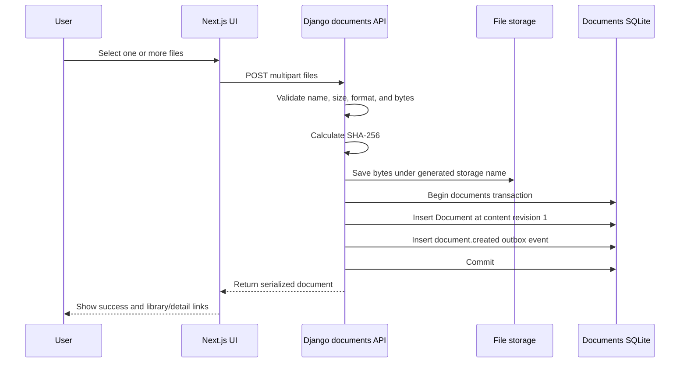
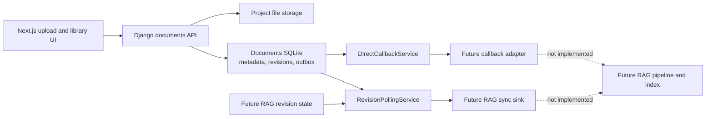

# Document File Handling and RAG Readiness

## Purpose

This document explains how the current document library accepts, validates,
stores, retrieves, updates, and deletes files. It then describes the features
already added to prepare those documents for a future retrieval-augmented
generation (RAG) system, the benefits of those features, and the remaining work
required to deliver an end-to-end RAG application.

The current implementation deliberately keeps three responsibilities separate:

```text
Next.js document UI
        |
        v
Django document source of truth
        |
        v
Future RAG adapters and application
```

The document library works independently today. A future RAG system will
consume document lifecycle information through defined interfaces without
moving extraction, embeddings, vector search, or language-model concerns into
the `documents` app.

## Current Document File Handling

### User-facing workflow

The Next.js application provides three document routes:

| Route | Purpose |
| --- | --- |
| `/documents/upload` | Select, queue, and upload one or more files with per-file progress and retry handling. |
| `/documents` | Search, filter, sort, inspect, and download documents in the library. |
| `/documents/{id}` | Edit the filename and other metadata, replace the stored file, download it, or delete the document. |

The browser sends document requests to relative `/api/documents/...` URLs.
Caddy keeps Next.js and Django on the same public origin and forwards `/api/*`
requests to Django. The UI displays live data returned by Django; it does not
maintain a separate browser-only document catalogue.

Authentication and document ownership are intentionally not implemented yet.
The current library must therefore not be exposed as a public production
service until access control is added.

### Supported files and validation

Phase one accepts files up to 25 MB in these formats:

| Format | Extensions | Content validation |
| --- | --- | --- |
| PDF | `.pdf` | Content must begin with the PDF signature. |
| Word | `.docx` | File must be a valid ZIP package containing `word/document.xml`. |
| Plain text | `.txt` | Content must be valid UTF-8. |
| Markdown | `.md`, `.markdown` | Content must be valid UTF-8. |
| CSV | `.csv` | Content must be valid UTF-8 and parse as at least one CSV row. |

Django does not trust the filename extension or browser-provided MIME type
alone. It reads and validates the file bytes, rejects empty or oversized
uploads, calculates the byte size and SHA-256 checksum, and assigns the
canonical content type itself.

Uploaded filenames are reduced to a safe base name. This prevents a supplied
path from controlling where a file is stored. The user-facing filename remains
editable, but changing it updates metadata only; it does not rename the
physical storage object.

### Storage model

By default, document data is kept under the project-local document data root:

```text
src/django/.data/documents/
├── metadata.sqlite3
└── files/
```

`DJANGO_DOCUMENT_DATA_ROOT` can relocate this root. Both the SQLite database
and physical file directory move together beneath the configured location.

The two parts have distinct responsibilities:

- `metadata.sqlite3` stores document records and durable document outbox
  events.
- `files/` stores the uploaded file bytes.

Physical files are saved with generated UUID-style names rather than
user-controlled filenames. The `Document` record maps that storage name to the
user-facing filename and contains:

- a stable document UUID;
- filename, title, description, and tags;
- validated content type and byte size;
- SHA-256 checksum;
- monotonic content revision;
- creation and update timestamps; and
- the physical file reference.

The `documents` Django app is routed to a dedicated `documents` database alias.
That alias currently points to `metadata.sqlite3`; other Django apps continue
using the main database. This preserves a clear persistence boundary and allows
the document metadata and outbox to move to PostgreSQL later without changing
the public API or Next.js routes.

### Upload flow



The document record and its `document.created` event are committed together.
If a caught database persistence failure occurs after the physical file has
been written, Django attempts to remove the new file to avoid leaving an
unreferenced object.

Multiple uploads are handled independently. A mixed batch can preserve
successful files, report individual failures, and allow failed files to be
retried.

### Library retrieval and download

The collection API returns serialized document records and supports:

- title and filename search;
- exact content-type filtering;
- case-insensitive tag filtering; and
- ordering by creation time, update time, or filename.

Each record includes a Django download URL. The download endpoint resolves the
stored file through Django's configured storage and streams it using the
editable, user-facing filename as the download name.

The API also exposes `contentRevision` and `sha256`. These values allow the
frontend and future integrations to distinguish a metadata change from a new
version of the underlying file.

### Metadata updates and filename changes

The editable metadata fields are:

- filename;
- title;
- description; and
- tags.

Updates are validated in a transaction that reloads the current document using
`select_for_update()`. The current SQLite database does not provide row-level
`SELECT FOR UPDATE` locking, so PostgreSQL-style row locking will only become
effective after the document database is migrated to a database that supports
it. A metadata-only update:

1. preserves the physical file;
2. preserves the SHA-256 checksum;
3. preserves `content_revision`; and
4. emits `document.metadata_updated` only if at least one value actually
   changed.

This means a filename correction does not falsely imply that the document
content needs to be re-embedded. The outbox payload identifies which metadata
fields changed so a future consumer can decide whether its searchable metadata
must be refreshed.

### File replacement

A replacement upload is fully validated before it becomes the current file.
Django then:

1. saves the replacement using a new generated storage name;
2. starts a transaction and reloads the current document with
   `select_for_update()`; this becomes an effective row lock on a supporting
   database such as PostgreSQL, but not on the current SQLite database;
3. updates its file reference, type, size, and SHA-256;
4. increments `content_revision` exactly once;
5. records `document.content_replaced` in the same database transaction; and
6. removes the superseded physical file after the database change succeeds.

If a caught database operation fails, the service attempts to remove the
replacement so the original record and file remain current. Metadata changed
in the same request is recorded separately as `document.metadata_updated`.

### Deletion

Deletion runs in a transaction, reloads the document using
`select_for_update()`, retains the file bytes for compensation, removes the
physical file, creates a durable `document.deleted` event, and deletes the
document record in one coordinated operation. As above, the requested row lock
is not provided by SQLite and becomes effective only after migration to a
supporting database.

The outbox event stores the document UUID as a plain value rather than a
foreign key. Consequently, the deletion instruction survives after the source
document record is gone and can later remove that document's chunks and vectors
from a RAG index.

The database and file storage are separate transactional resources. The
services compensate for caught failures, but they cannot make both resources
crash-atomic. An abrupt process or storage failure can still leave an orphaned
file or a database record whose file is missing. Production operations should
therefore include storage-to-database reconciliation and backup/restore
procedures.

## Features Added for RAG Readiness

### Content identity and revision tracking

Every document has two complementary content identifiers:

- `content_revision` is a monotonic version number. It starts at `1` and
  increments only when the physical file is replaced.
- `sha256` identifies the exact source bytes.

Together they provide a deterministic way to tell whether an indexed document
matches the current source. Metadata-only changes do not cause unnecessary
content reprocessing.

**Benefit:** indexing can be idempotent, stale work can be detected, and a
consumer can avoid paying for extraction and embeddings when the bytes have not
changed.

### Transactional durable outbox

Document creation, content replacement, metadata updates, and deletion append a
versioned event to `DocumentOutboxEvent` in the same SQLite transaction as the
document mutation.

The supported schema-version-1 events are:

| Event | Meaning |
| --- | --- |
| `document.created` | A new source document is available at revision 1. |
| `document.content_replaced` | The source bytes changed and the revision increased. |
| `document.metadata_updated` | One or more editable metadata fields changed. |
| `document.deleted` | The source was removed and downstream representations must be deleted. |

Events contain identifiers, revision information, checksum, timestamps, and
minimal metadata. They do not expose physical storage paths or embed file
contents in the outbox.

**Benefit:** a committed document change cannot be silently lost merely because
a downstream RAG service was temporarily unavailable. The document app remains
usable even when no RAG system exists or is running.

### Reliable at-least-once callback delivery

`DirectCallbackService` is a complete, transport-independent outbox dispatcher.
It:

- claims a bounded batch of eligible events;
- assigns claim tokens and expiring leases;
- delivers each event through a small callback interface;
- marks successful events as dispatched;
- retries failures with bounded exponential backoff;
- recovers work after an expired claim; and
- moves repeatedly failing events to a dead-letter state that can be requeued.

The one-shot command is:

```sh
python manage.py dispatch_document_outbox
```

The callback implementation is supplied through `DOCUMENT_EVENT_CALLBACK`.
No HTTP client, message broker, RAG callback, or scheduler has been chosen or
implemented.

**Benefit:** future delivery can use an in-process adapter, HTTP endpoint,
message broker, or another transport without changing document persistence.
Lease and retry behaviour makes the workflow resilient to worker interruption.
Because delivery is at least once, the future consumer must deduplicate by
event UUID.

### Independent revision polling and reconciliation

`RevisionPollingService` compares immutable source revision snapshots with
revision state reported by a future RAG index. It requests:

- synchronization when a document is missing from the index;
- synchronization when revision, checksum, or source update time differs;
- no action when source and index are current; and
- deletion when the RAG index contains a document that no longer exists in the
  source library.

The one-shot command is:

```sh
python manage.py reconcile_document_revisions
```

The indexed-state reader and synchronization command sink are supplied through
`DOCUMENT_RAG_REVISION_STATE_READER` and
`DOCUMENT_RAG_SYNC_COMMAND_SINK`. The repository does not provide their
RAG-side implementations or a schedule for running the command.

**Benefit:** polling acts as a consistency repair path. It can recover from
missed callbacks, operator mistakes, restored backups, or index drift instead
of assuming the event stream is permanently perfect.

### Scheduler-neutral operations

Both integration commands perform one bounded unit of work and terminate.
Scheduling is intentionally left to the future deployment environment, such as
a container platform job, cron, Celery Beat, or another orchestrator.

**Benefit:** the domain and application services are not coupled to a job
framework that may later be replaced.

### SOLID separation of concerns

The implementation follows this dependency direction:

```text
documents <- document_integrations <- future RAG adapters/application
```

- The `documents` app owns validation, source files, metadata, revisions, and
  lifecycle events.
- The `document_integrations` app owns callback delivery and revision
  reconciliation orchestration.
- Future adapters will own RAG-specific I/O.
- A future RAG application will own extraction, chunks, embeddings, indexes,
  retrieval, prompts, and model calls.

The integration services depend on small protocols for the outbox, clock,
callback, revision repository, indexed-state reader, and synchronization sink.
Django ORM access and configuration loading remain outer adapters.

**Benefit:** the document library can be tested and operated independently.
RAG technology choices can change without rewriting upload and CRUD workflows,
and test doubles can replace infrastructure at each interface.

### Current RAG-readiness data flow



Uploading or managing a document therefore participates in RAG readiness now:
it maintains revision/checksum state and creates durable lifecycle events.
However, it does not automatically extract, embed, or index content until a
future adapter is configured and the relevant command is run by an operator or
scheduler.

## What Still Needs to Be Added for End-to-End RAG

### 1. A RAG-owned source-content reader

Revision snapshots deliberately contain no storage path or file bytes. The RAG
side needs an adapter that can retrieve the current bytes for a document UUID
and expected revision/checksum. This could use an authenticated Django API or a
storage abstraction, but it should not depend on private file paths.

The reader should verify the revision and SHA-256 before indexing so a slow job
cannot overwrite newer index state with stale content.

### 2. Extraction and normalization

Add format-specific extractors for the current file types:

- PDF text and structural extraction;
- DOCX paragraphs, tables, headings, and relevant metadata;
- plain text and Markdown decoding;
- CSV row/column-aware extraction.

The extraction layer should return a common normalized document representation
with source locations. PDF scans and future image uploads will also require OCR.
Future spreadsheet and PowerPoint support will require their own
structure-aware extractors. Adding images, spreadsheets, or PowerPoint files
also requires extending the Django upload allowlist and byte validation,
assigning canonical content types, updating the frontend file selector, and
adding format-specific API, validation, and UI tests; extraction changes alone
are not sufficient.

### 3. Chunking and provenance

Create a chunking strategy that respects document structure and stores:

- stable chunk identifiers;
- source document UUID and content revision;
- page, heading, sheet, slide, row, or other source location;
- chunk text and searchable metadata; and
- the checksum or version of the chunking algorithm.

Stable provenance is necessary to cite the uploaded document accurately in a
generated answer.

### 4. Embedding generation

Choose an embedding model and implement batching, rate-limit handling, retry,
and model-version tracking. Re-embedding rules must account for changes to the
source revision, extraction logic, chunking strategy, or embedding model.

### 5. Vector and index persistence

Add a RAG-owned persistence layer for chunks, embeddings, and indexed revision
state. PostgreSQL with `pgvector` is one possible choice, but the current
interfaces do not require it.

At minimum, indexed document state should record:

- document UUID;
- indexed content revision and source SHA-256;
- source update time;
- extraction, chunking, and embedding versions;
- indexing status and last error;
- timestamps; and
- the chunks/vectors belonging to that revision.

This store must support atomic replacement or version activation so retrieval
never mixes chunks from two revisions.

### 6. Concrete event and polling adapters

Implement the three currently configured extension points:

- `DOCUMENT_EVENT_CALLBACK` to accept lifecycle events and enqueue or execute
  idempotent RAG work;
- `DOCUMENT_RAG_REVISION_STATE_READER` to return the revisions currently active
  in the RAG index; and
- `DOCUMENT_RAG_SYNC_COMMAND_SINK` to request document synchronization and
  deletion.

These adapters belong on the RAG/infrastructure side of the boundary. Event
UUIDs and `(document UUID, content revision)` should be used as idempotency
keys.

### 7. Background execution and scheduling

Choose and operate a worker/job mechanism for potentially expensive extraction
and embedding work. Schedule:

- frequent bounded outbox dispatch;
- periodic revision reconciliation; and
- dead-letter and failed-index monitoring.

The job system should support retries, concurrency limits, cancellation of stale
revisions, and safe restart after interruption.

### 8. Retrieval

Implement the query side of RAG:

1. normalize the user's question;
2. generate a query embedding;
3. apply authorization and metadata filters;
4. retrieve candidate chunks using vector, keyword, or hybrid search;
5. optionally rerank candidates; and
6. enforce context-size and diversity limits.

Retrieval should return both content and provenance rather than untraceable text
alone.

### 9. Generation and citations

Add an LLM-facing application service that builds a grounded prompt from the
retrieved chunks, instructs the model to stay within the evidence, and returns
citations linked to document UUIDs and source locations. The generation layer
should handle insufficient evidence explicitly rather than inventing an
answer.

### 10. Authentication, authorization, and data isolation

Before public or multi-user use, add authentication and define ownership,
roles, sharing, and deletion permissions. The same access rules must be copied
or resolvable in the RAG index and enforced during retrieval; filtering only in
the Next.js UI is not sufficient.

Uploads also need production controls such as malware scanning, archive limits,
content sanitization where appropriate, quotas, and retention policies.

### 11. Indexing status and operations

Add RAG-owned status such as queued, extracting, embedding, indexed, stale, and
failed. Surface useful status and retry actions in the document UI without
making the document record itself own RAG state.

Operational support should include metrics, structured logs, traces,
dead-letter alerts, reconciliation reports, backup/restore procedures, and
storage/orphan audits.

### 12. RAG quality and reliability tests

Extend testing beyond the existing document and integration unit tests with:

- extractor fixtures for every supported format;
- chunking and citation-provenance tests;
- idempotent reprocessing and stale-job tests;
- index replacement and deletion tests;
- end-to-end upload-to-answer tests;
- authorization leakage tests;
- retrieval relevance and grounded-answer evaluation datasets; and
- failure tests for providers, workers, storage, and partial retries.

## Minimum End-to-End RAG Path

The smallest useful implementation sequence is:

1. Create a separate RAG package/service and its indexed-revision model.
2. Implement a revision-safe document content reader.
3. Add extractors for PDF, DOCX, TXT, Markdown, and CSV.
4. Add provenance-preserving chunking.
5. Add an embedding adapter and vector store.
6. Implement idempotent sync/delete jobs.
7. Connect those jobs through the callback and polling interfaces.
8. Add a worker and schedules for dispatch and reconciliation.
9. Implement retrieval with metadata and authorization filters.
10. Add grounded answer generation with citations.
11. Surface indexing state and operational failures in the Next.js UI.
12. Add evaluation, observability, and production security controls.

## Conclusion

The current document library is already a reliable source system for a future
RAG application. It validates and stores the source bytes, records rich
metadata, identifies exact content revisions, publishes durable lifecycle
events, provides resilient callback delivery, and offers independent revision
reconciliation. These capabilities solve the source-of-truth and change
notification problems without coupling document CRUD to a specific RAG stack.

What remains is the RAG system itself: secure content access, extraction,
chunking, embeddings, index storage, background jobs, retrieval, grounded
generation, citations, access enforcement, observability, and quality
evaluation. Those components should remain downstream of the existing
interfaces so the document library continues to work independently and the RAG
implementation can evolve without destabilizing file management.
